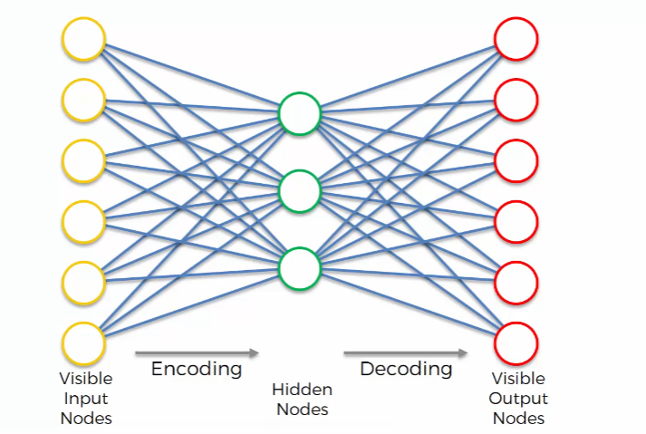
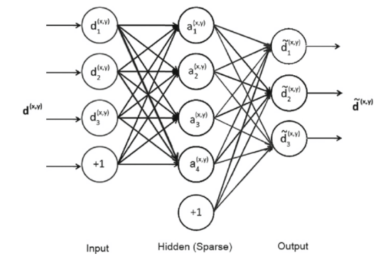
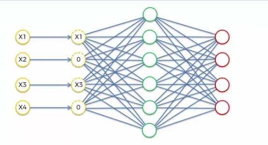
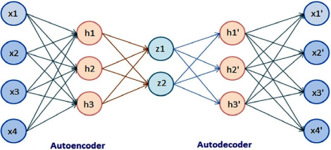
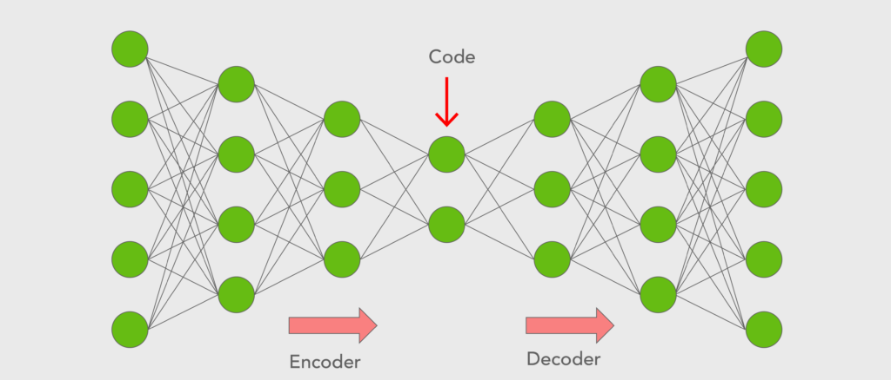

# Autoencoders

Takes some **inputs**, pushes them through a `neural network`, and then tries to **reconstruct** the **original inputs**. The network is trained to minimize the difference between the original inputs and the reconstructed inputs. The network is forced to **learn** the **most important features** of the data.

The hidden layer is called the **bottleneck**. The bottleneck is the **compressed** version of the input. 
`softmax` function is used to **normalize** the output. It returns 1 for the largest value and 0 for the smallest value. 
Autoencoders a very good at compressing data. They can be used to **reduce** the dimensionality of the data.

The detailed representation of the autoencoders is shown in the image below:
It also contain the **bias**. `Bias` is a constant that is added to the output of the neuron. It is used to shift the activation function to the left or right.

## Training Autoencoders

### Step 1

Start with an array where the `lines` (the **observations**) correspond to the users and the `columns` (the **features**) correspond to the movies. The values in the array are the ratings that the users gave to the movies. Ratings are between 1 and 5 and 0 means that the user did not rate the movie.

### Step 2

The first user goes in the network. The input vector is:
$$ x=(r_1, r_2, ..., r_m) $$
where $r_i$ is the rating that the user gave to the movie $i$.

### Step 3

The input vector $x$ is encoded into a vector $z$ of lower dimension by mapping a sigmoid function $f$:
$$ z=f(W_1x+b) $$
where $W_1$ is the `input weights` and $b_1$ is the `bias`.

### Step 4

$z$ is decoded into a vector $y$ of the same dimension as $x$ by mapping a sigmoid function $g$:
$$ y=g(W_2z+b) $$
where $W_2$ is the `output weights` and $b_2$ is the `bias`.
Aiming to replicate the input vector $x$.

### Step 5

The `loss` function is the `mean squared error`:
$$ L(x,y)=\frac{1}{m}\sum_{i=1}^m (x_i-y_i)^2 $$
where $m$ is the number of movies.
The goal is to **minimize** the **loss** function.

### Step 6

The **error** is back-propagated through the network to update the weights $W_1$ and $W_2$ and the biases $b_1$ and $b_2$. The **learning rate** is used to control the size of the update.

### Step 7

When all the training set passes through hte network, the epoch is finished and the weights and biases are updated. The process is repeated for several epochs.

### Step 8

The autoencoder is now trained. It can be used to encode new users into the latent space. The new users can be decoded into the original space to make new predictions.

## Types of Autoencoders

## Overcomplete Hidden Layers

The hidden layer is called the **bottleneck**. The bottleneck is the **compressed** version of the input. If the hidden layer is bigger than the input layer, the autoencoder is said to have an **overcomplete hidden layer**. We do this in order to extract more features from the data. 

## Sparse Autoencoders

Is a overcomplete autoencoder (the hidden layer is bigger than the input layer).

Sparse autoencoders are autoencoders that have a **sparsity constraint** on the activations of the hidden layer. The sparsity constraint is a **regularization** technique that forces the activations of the hidden layer to have only a few non-zero activations. This forces the autoencoder to learn more **efficient** representations.

At any time the autoencoder is allowed to use only a few hidden units. The autoencoder is forced to learn a **compact** representation of the input. The hidden units that are not used are called **dormant**.

## Denoising Autoencoders

Denoising autoencoders are autoencoders that are trained to reconstruct **noisy** inputs. The autoencoder is trained to **denoise** the inputs. The autoencoder is trained to **ignore** the noise and **focus** on the **important** features of the data.

## Contractive Autoencoders

Contractive autoencoders are autoencoders that are trained to **minimize** the **contractive loss**. The contractive loss is a **regularization** technique that **penalizes** the **weights** of the network for **contracting** the **latent space**. The contractive loss is a **penalty** that is added to the **loss** function.

## Stack of Autoencoders

Stack of autoencoders are autoencoders that are **stacked** on top of each other. The first autoencoder is trained to **compress** the data. The second autoencoder is trained to **compress** the output of the first autoencoder. The process is repeated for all the autoencoders in the stack. The last autoencoder is trained to **reconstruct** the data.

## Deep Autoencoders

Are autoencoders are stacked RBMs. The first RBM is trained to **compress** the data. The second RBM is trained to **compress** the output of the first RBM. The process is repeated for all the RBMs in the stack. The last RBM is trained to **reconstruct** the data.

