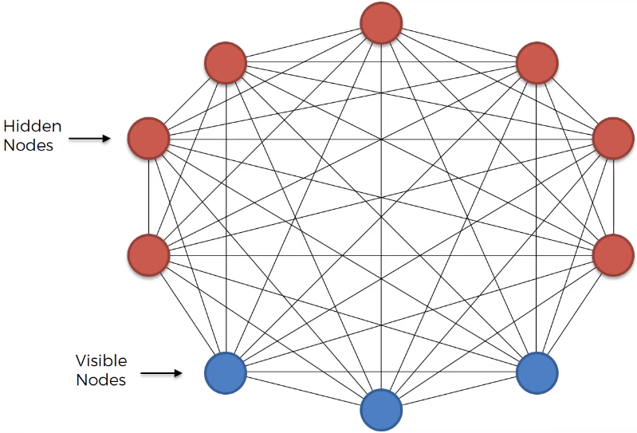
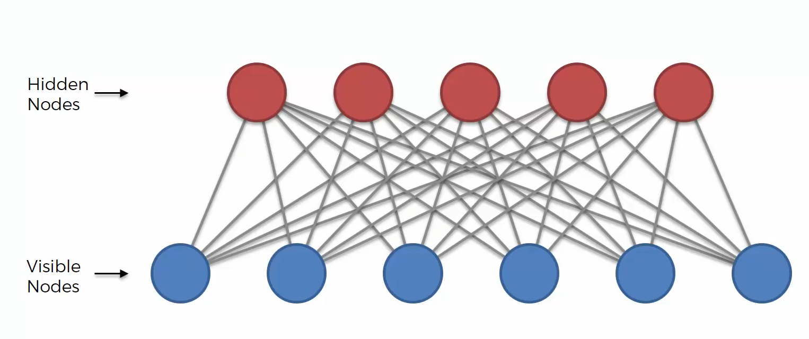
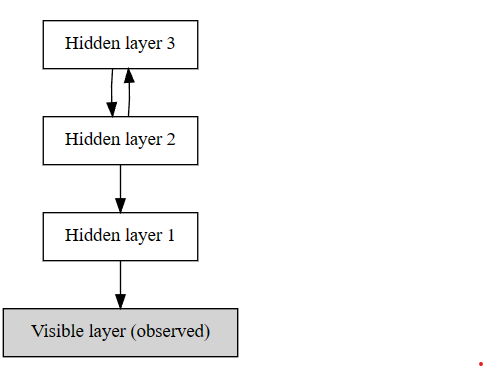
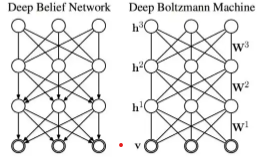

# Boltzmann Machines

The ANN, CNN, RNN and SOM are `directional models`. There is a direction which which they operate.

Bolzmann Machines are `not directional`. They are `symmetric` and `bidirectional`.

There are no `output nodes`. There are `hidden nodes` and `visible nodes`.

The bolzmann machine is a `generative model`. It can generate new data. They don't just expect input data. For bolzmann machines all the n nodes the same. For the user the distinction between visible and hidden nodes is not important. 

The boltzmann machine is a representation of a certain system. 

Its not a `deterministic` model. It is a `probabilistic` model, or a `stochastic` model or better known as `generative model`.

Model a system with a good behavior and detect anomalies (abnormal states).

## EMB - Energy Base Models

The name comes from the fact that the model is based on the `Boltzmann distribution`.

Formula: 

$$ p_i = \frac{e^{-E_i}}{\sum_{j=1}^n e^{-E_j}} $$

where $p_i$ is the probability of the state $i$ and $E_i$ is the energy of the state $i$. 

The **higher** the `energy` the **less** likely the `state` is.
A system is stable when the overall energy is low.

In Boltzmann machines the `energy` is the `sum of the weights` of the connections between the nodes. The system tries to find a `stable state` with the `lowest energy`.

## RBM - Restricted Boltzmann Machines 

Is a Boltzmann machine with `no connections between the hidden nodes and the visible nodes`.

## Contrastive Divergence

The `visible nodes` are propagating and calculate the hidden nodes. The `hidden nodes` are propagating and calculate the `visible nodes`. And this process continues back and forth until the `visible nodes` are stable. This is called `gibbs sampling`.
Beeing stable means that the `visible nodes` are not changing anymore the next time they are propagating. The process converges to a `stable state`. `Weights` are not changing during this process. 

## DBN - Beep Belief Networks

A `deep belief network` is a `stack of RBMs`. The `visible nodes` of the first RBM are the `hidden nodes` of the second RBM and so on. The `visible nodes` of the last RBM are the `output nodes` of the `deep belief network`.

**Awake-sleep algorithm** is used to train the `deep belief network`. 

## DBM - Deep Boltzmann Machines

The difference between a `deep belief network` and a `deep boltzmann machine` is that the in the `DBM` all the connections are undirected.

