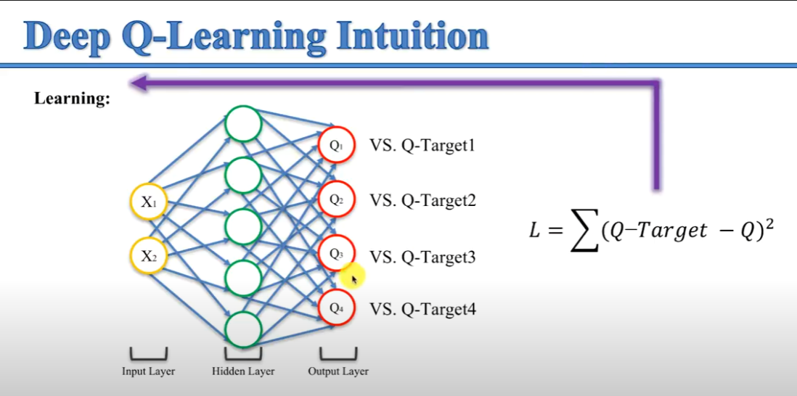

# Deep Q-Learning

## Learning

## Acting

## Experience Replay

Anytime the agent reaches a new state the whole process of learning and acting is repeated. This is a problem because the agent will not be able to learn from the experience of the previous state. To solve this problem we use **experience replay**. 

**Experience replay** is a technique that allows the agent to learn from the experience of the previous states. The agent will store the experience of the previous states in a memory. The agent will then sample a batch of **experiences from the memory** and use it to learn. This technique allows the agent to learn from the **experience of the previous states**.

It takes a uniformly distributed random sample of size `batch_size` from the memory. The batch is then used to learn. The batch is a list of tuples `(state, action, reward, next_state, done)`. The `done` variable is a boolean that indicates if the episode is over or not.

In this way it breaks the correlation between the states and the actions. This is important because the agent will not be able to learn from the experience of the previous states. Some times are very **rare experiences** and the agent will not be able to learn from them, hence the need for **experience replay**.

It also helps learning faster because the agent will learn from a batch of experiences instead of learning from a single experience.

## Action Selection Policies

for selection of the action can be used:

 - **$\epsilon $-Greedy**
 - **$\epsilon $-Soft**
 - **Softmax**

**Exportation vs Exploitation** dilemma - the agent has to choose between exploring the environment and exploiting the knowledge it has already acquired.

Sometimes it gets stuck in a **local maximum** - and it chooses one action because it didn't gee the chance to explore the other actions. Its bias towards the action that it has already chosen.

**epsilon-greedy policy** - the agent will choose the action with the highest Q-value with probability $1-\epsilon $ and it will choose a random action with probability $\epsilon $. Meaning if you choose  epsilon = 0.1, the agent will choose the action with the highest Q-value 90% of the time and it will choose a random action 10% of the time.

**epsilon soft policy** - the agent will choose the action with the highest Q-value with probability \epsilon $ and it will choose a random action with probability 1-$\epsilon $. Meaning if you choose  epsilon = 0.1, the agent will choose the action with the highest Q-value 10% of the time and it will choose a random action 90% of the time. Its opposite of the **epsilon-greedy policy**.

## Softmax Action Selection

Formula: 

$$ f_j(z) = \frac{e^{z_j}}{\sum_{k=1}^K e^{z_k}} $$

where $z_j$ is the Q-value of the action $j$ and $K$ is the number of actions.

All the values are positive and they **sum up to 1**. The higher the Q-value the higher the probability of choosing that action.

After Softmax there are probabilities for each action. The agent will choose the action with the highest probability.
4

