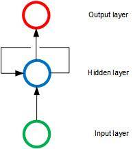
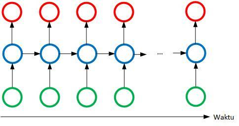
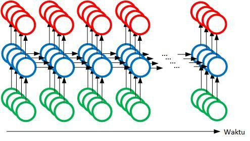
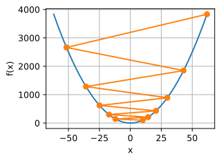
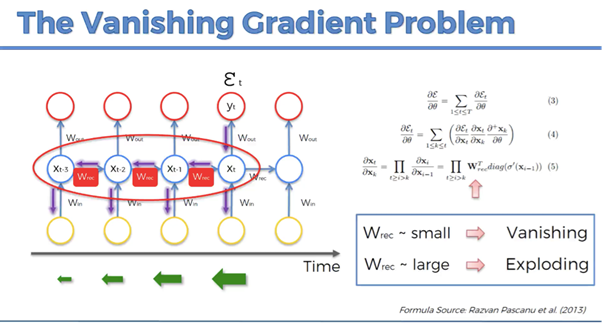
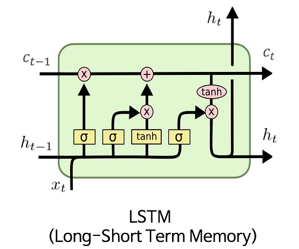

# RNN - Recurrent Neural Networks

# Introduction

Supervised Deep Learning:

- [ANN - Artificial Neural Networks](ANN.artificial.neural.networks.md)
- [CNN - Convolutional Neural Networks](CNN.Convolutional.Neural.Networks.md)
- [RNN - Recurrent Neural Networks](RNN.Recurrent.Neural.Netowrks.md)

Unsupervised Deep Learning:

- [AutoEncoders](Autoencoders.md)
- [Restricted Boltzmann Machines](Restricted.Boltzmann.Machines.md)
- [Self Organizing Maps](Self.Organizing.Maps.md)

`RNN` are the most complex type of neural networks. They are used for time series prediction. They are used for text generation, speech recognition, image captioning, machine translation, etc.

For a `ANN` the `weights` represent the `long term memory` of the network. So in a comparison with the human brain the `ANN` is like the `long term memory` of the human brain and goes to the `temporal lobe`.

`CNN`s are used for image recognition and classification. They are used for object detection, image captioning, etc. so in a comparison with the human brain the `CNN` is like the `visual cortex` and is located in the `occipital lobe`.

For a `RNN` the `weights` represent the `short term memory` of the network. In a comparison with the human brain the `RNN` is like the `short term memory` and is located in the `frontal lobe`.

## Graphical Representation of a RNN

From a normal ANN with n inputs and m outputs we can create a RNN by adding a loop to the output layer. The loop is called `recurrent connection` and it is used to pass the output of the previous step to the input of the current step.

In the graphical representation of a RNN the ANN looks squashed and the recurrent connection is represented by a loop. The input would be a vector of n elements and the output would be a vector of m elements.

Normal ANN:

Flattened ANN and a `temporal loop`:

The loop is also called `temporal loop` and it is used to pass the output of the previous step to the input of the current step.

The modern graphical representation of a RNN is the following:

3d representation of a RNN:

# RNN in action

The neurons are connecting to themselves through time and the `temporal loop` is represented by a `time axis`. They remember the previous state which is called short term memory. The `temporal loop` is also called `memory cell`.

`One to many`: the input is one and the output is many. For example, the input is an image and the output is a caption. There is a CNN that extracts the features from the image and the RNN generates the caption.

`Many to one`: the input is many and the output is one. For example, the input is a sentence and the output is a sentiment. The RNN generates the sentiment from the sentence.

`Many to many`: the input is many and the output is many. For example, the input is a sentence and the output is a translation. The RNN generates the translation from the sentence. Also can be used to subtitle a video.

`One to one`: the input is one and the output is one. For example, the input is an image and the output is a sentiment. There is a CNN that extracts the features from the image and the RNN generates the sentiment.

## Vanishing Gradient Problem

Gradient Descent graphical representation for a ANN :

$$ C = \frac{1}{2} \sum_{i=1}^{n} (y_i - \hat{y_i})^2 $$

The calculated error propagates backwards through the network and the weights are updated. In case of RNN is not only propagated in the network at the current time `t` but also in the past networks at `t-1`, `t-2`, ... .
During the back propagation in time the gradient is multiplied by the weights and the gradient is getting smaller and smaller. This is called `vanishing gradient problem`.

The gradient is getting smaller and smaller and the weights are not updated anymore. The network is not learning anymore.

Since the training of the network at time `t` depends on the network at time `t-1`, `t-2`, ... the network is not able to learn long term dependencies because its trained by untrained neurons from `t-n`.

If $W_{rec}$ is the weight matrix of the recurrent connection.
If $W_{rec}$ is `small` the gradient is small and the network is not learning anymore - `vanishing gradient problem`.

If $W_{rec}$ is `big` the gradient is big and the network is learning too fast and it is not able to converge - `exploding gradient problem`.

Solution for exploding gradient problem:

- `Truncated BPTT`: the gradient is not propagated through the whole network but only through a few steps. The gradient is not propagated through the whole network but only through a few steps. The gradient is not propagated through the whole network but only through a few steps. - not ideal solution

- `Penality`: the gradient is penalized if it is too big and artificial reduced - not ideal solution

- `Gradient Clipping`: the gradient is clipped to a maximum value. The gradient is not allowed to be bigger than a certain value. - `ideal solution`

Solutions for vanishing gradient problem:

- `Weight initialization`: the recurrent connection is initialized with a small value. - not ideal solution

- `Echo state network`: the recurrent connection is not trained but it is randomly initialized. - not ideal solution

- `Long Short Term Memory Netowrks (LSTMs)`: the recurrent connection is trained with a special gate. - `ideal solution`

## Long Short Term Memory Networks (LSTMs)

Graphical representation of a LSTM:

Graphical representation of a LSTM, one neuron:

Legenda for the graphical representation of a LSTM:

Legend for LSTM:

- $x_t$: input at time `t`
- $h_t$: output at time `t`
- $c_t$: memory cell at time `t`
- $x_{t-1}$: input at time `t-1`
- $h_{t-1}$: output at time `t-1`
- $c_{t-1}$: memory cell at time `t-1`
- $\sigma$: sigmoid function

[Understanding LSTM Networks](http://colah.github.io/posts/2015-08-Understanding-LSTMs/)

## LSTM variations

- `Peephole LSTM`: the memory cell is connected to the output gate. The memory cell is connected to the output gate.

- `Gated Recurrent Unit (GRU)`: the memory cell is not used. The memory cell is not used.
