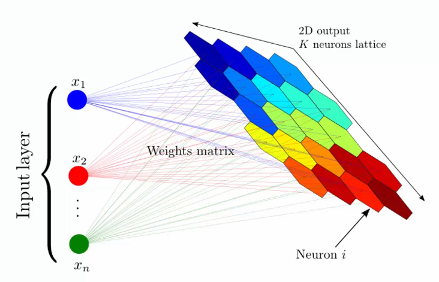
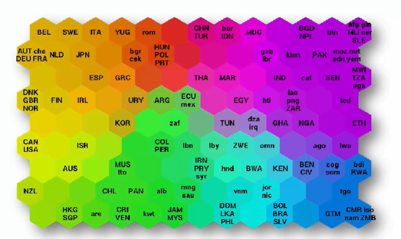
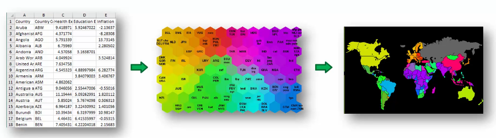
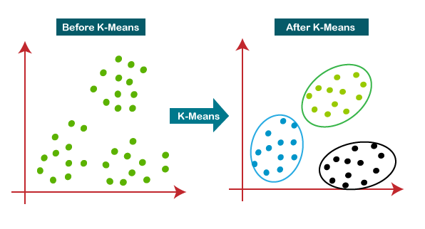
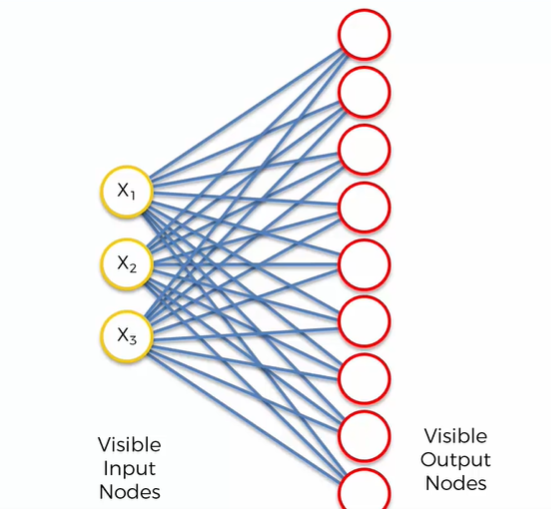
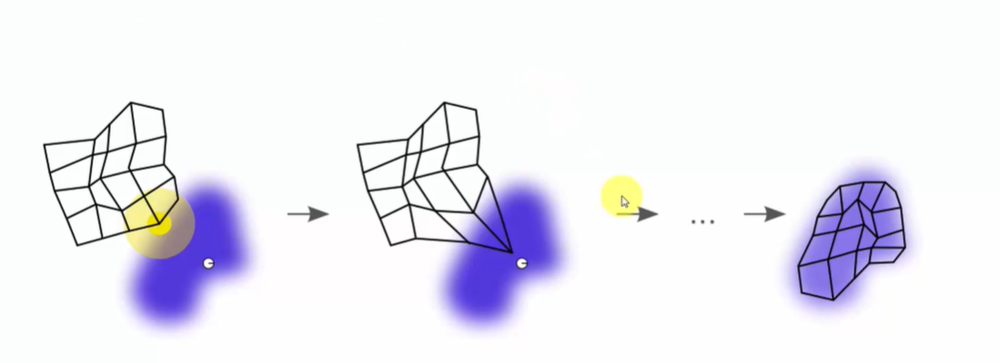
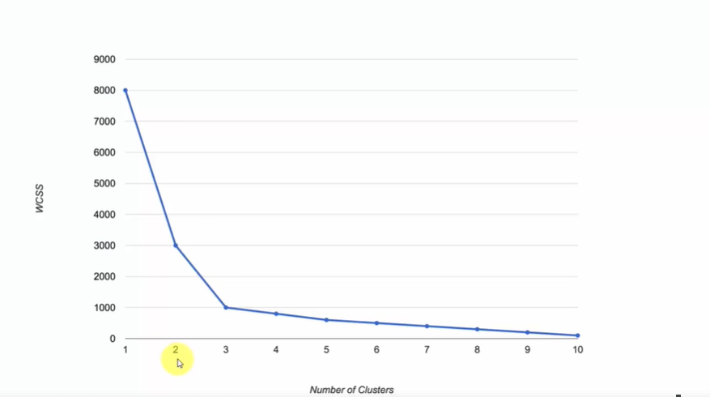

# SOM - Self Organizing Maps

Reduce the complexity of the data by grouping similar data points together in a map. If data is organized in columns, with lots and lots of columns, then SOM can be used to reduce the number of columns. And ends up with a map of the data in `two dimensions`.

graphical representation of SOM:

example of  SOM - poverty, quality of life, ... in the world:

SOM is a type of `unsupervised learning`.

exampple of full application:

## K-Means Clustering

Given a list of scattered points, K-Means clustering will group them into K clusters. The algorithm will start by randomly selecting K points as the initial `centroids`. Then, it will assign each point to the nearest `centroid`. After that, it will recompute the centroids based on the points assigned to them. The algorithm will repeat the last two steps until the `centroids stop moving`.

K-Means algorithm steps:

Step 1. Decide on a `number of clusters K`.

Step 2. Select K random points as the `initial centroids`. (The points can be selected randomly or by using the K-Means++ algorithm.) - not necessary to be in the data set.

Step 3. `Assign each point` to the `nearest centroid`. (The distance between two points can be calculated using Euclidean distance.)

Step 4. `Recompute the centroids` based on the points assigned to them.

Step 5. Repeat steps 3 and 4 until the `centroids stop moving`, or no reassignments happen. If the centroids stop moving, then the `algorithm has converged`.

A `scatter plot` is a graph with points plotted for `two variables`. The points are plotted along two axes, the horizontal axis and the vertical axis. The position of a point on the horizontal axis is determined by its first value, and the position of a point on the vertical axis is determined by its second value.

If there are n dimensions, then the scatter plot will be n-dimensional. Which is **not easy to visualize**. So, we can use `SOM` to **reduce** the number of dimensions to **2**.

In the algorithm, the `distance` between two points is calculated using the `Euclidean distance`. The Euclidean distance between two points is the `square root` of the `sum of the squared differences` between the two points. But there can be used other distances, like `Manhattan distance`, `Minkowski distance`, etc.

## How do SOM learn?

The data has three dimensions: $x_1$, $x_2$. $x_3$.

Each node in the map has three dimensions: $w_{1,1}$, $w_{1,2}$, $w_{1,3}$ which are the weights of the node. Where the index $1$ is the node number, and the index $1,2,3$ is the dimension of the node.

The weights are initialized randomly. 

Then the `row number` 1 is inputed to the network. 

The distance between the input and the weights is calculated. The node with the smallest distance is the `winner node`. The weights of the **winner node** are **updated**. The weights of the **other nodes** are **not updated**.

The distance is calculated using the `Euclidean distance`:

$$
d = \sqrt{(x_1 - w_{1,1})^2 + (x_2 - w_{1,2})^2 + (x_3 - w_{1,3})^2}
$$

or the generic formula:

$$
d = \sqrt{\sum_{i=1}^n (x_i - w_{1,i})^2}
$$

Make sure that the inputs are normalized meaning values between 0 and 1. The weights are also normalized.

The winner node is the node with the smallest distance and is called `BMU - Best Matching Unit`.  The BMU weights are updated using the `learning rate` $\alpha$ and the `neighborhood function` $\sigma$.

Visual aid to see how the weights are updated:

You can see that the BMU is drown closer to the input. The other nodes are not updated. And this repeats for all the inputs, until in the end you get the map over the data.

Next step is to adjust the nodes which are in a certain radius around the BMU.  The nodes closer to the BMU are updated more than the nodes further away. 

After all the rows are processed an **epoch** is completed. The learning rate and the neighborhood function are updated. For the next epoch the learning rate and the neighborhood function are smaller (the **radius is smaller**).

The algorithm repeats until the learning rate is small enough. The learning rate is small enough when the **weights of the nodes** are **not changing** anymore.

> Important: 
>  - SOMs retain the topology of the input space (input set).
>  - SOMs reveal correlations which are not obvious in the input space (which are not easily identified).
>  - Classify data without supervision. No supervised learning is needed.
>  - There is no backpropagation. No target vector (values) are needed.
>  - No lateral connections between output nodes. No hidden layers.

## Random Initialization Trap

The weights are initialized randomly. If the weights are initialized in a bad way, then the algorithm will not converge. The weights will not be updated anymore. The algorithm will not learn anything.

The solution is K-Means++ algorithm. The K-Means++ algorithm is used to initialize the weights. The K-Means++ algorithm is used to initialize the centroids. 

## K-Means Intuition - Chooqing the right number of clusters

Within cluster sum of squares (WCSS) is the **sum of the squared distances** between each member of the cluster and its centroid. The idea is to choose a number of clusters so that adding another cluster doesn't give much better modeling of the data.

**WCSS** is an abbreviation for `Within Cluster Sum of Squares`. The formula is:

$$ WCSS = \sum_{i=1}^n \sum_{j=1}^k distance(x_i - c_j)^2 $$

where:
 $x_i$ is the $i^{th}$ data point, 
$c_j$ is the $j^{th}$ centroid, 
and $k$ is the number of clusters.

Simplified formula for 3 clusters:

$$ WCSS = \sum_{i=1}^n distance(x_i - c_1)^2 + \sum_{i=1}^n distance(x_i - c_2)^2 + \sum_{i=1}^n distance(x_i - c_3)^2 $$

WCSS is a metric that measures the `intra-cluster cohesion`. **The smaller the WCSS, the better the clustering.** The WCSS is calculated for each number of clusters. The number of clusters that gives the smallest WCSS is the best number of clusters.

The WCSS is getting better and better when increasing the number of clusters. 
When the number of clusters is equal to the number of data points, then the WCSS is 0.

### How to find the optimal value of K?

The **Elbow Method** is used to find the optimal value of K. The Elbow Method is used to find the optimal number of clusters. 
