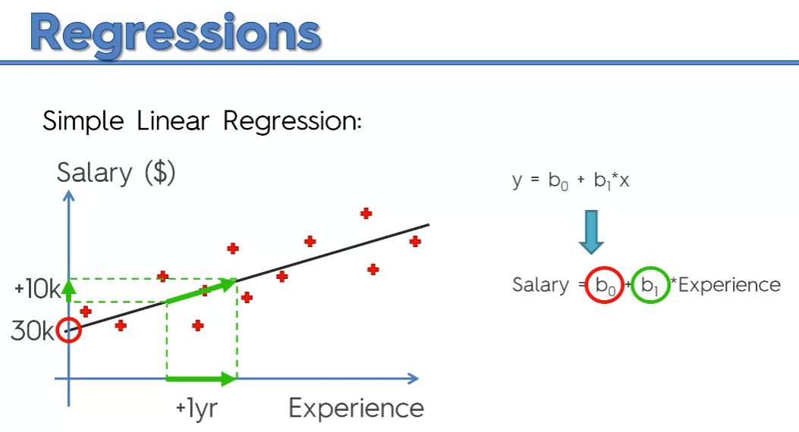
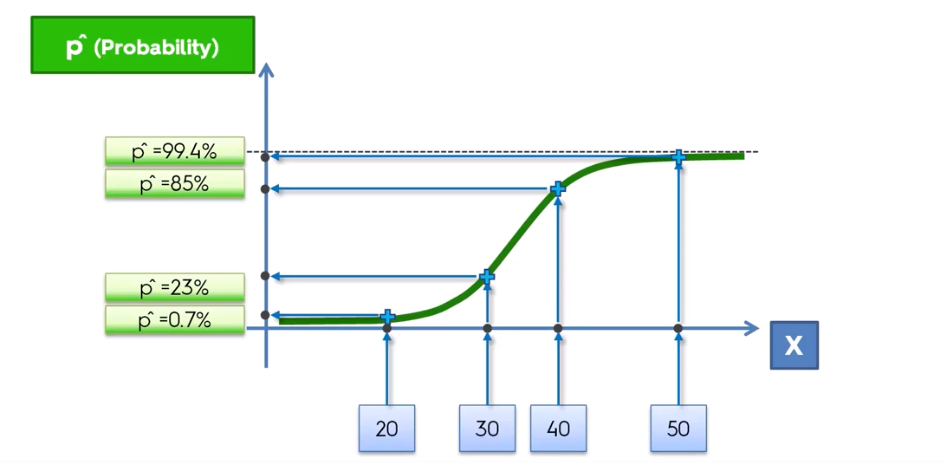

# Regressions

## Linear Regression

**Linear Regression** is a statistical method for `modelling the relationship between` a scalar dependent variable $y$ and one or more explanatory variables (or independent variables) denoted $X$. The case of one explanatory variable is called simple **linear regression**. For more than one explanatory variable, the process is called **multiple linear regression**.

Formula:  $$ y = \beta_0 + \beta_1 x $$
where:
$y$ is the dependent variable,
$x$ is the independent variable,
$\beta_0$ is the intercept, - intersection with the y axis,
and $\beta_1$ is the slope.

$beta_1$ how affects a **unit change** in $x$ on $y$.

prediction:

## How to calculate the slope and intercept

Ordinary Least Squares (OLS) method:

$$SSE = \sum_{i=1}^{n} (y_i - \hat{y_i})^2$$

where:
$y$ is the real value, 
$\hat{y}$ is the predicted value.
$SSE$ is the sum of squared errors.

 To find the best fit line, we need to minimize the sum of squared errors (SSE). Which is done by finding the slope and intercept that minimizes the SSE. The algorithm for finding the best fit line is called **Ordinary Least Squares (OLS)**.

## Multiple Linear Regression

$$ y = \beta_0 + \beta_1 x_1 + \beta_2 x_2 + ... + \beta_n x_n $$

## Logistic Regression

**Logistic Regression** is a statistical method for `modelling the relationship between` a dependent binary variable and one or more independent variables. It is used to `predict a binary outcome` (1 / 0, Yes / No, True / False) given a set of independent variables.

calculated probability:

calculated projection:

The **threshold** is the point at which the probability of the positive class is `0.5`. The **threshold** can be adjusted to change the sensitivity and specificity of the model.
