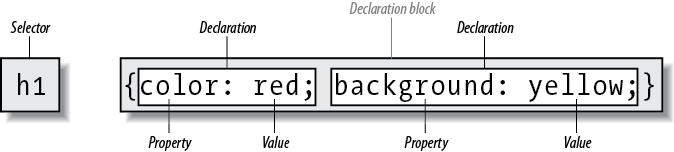

#CSS Fundamentals

Images and paragraphs are not the same type of element, nor are `span` and `div`. In CSS, elements generally take two forms: **replaced** and **nonreplaced**.

####Replaced Documents

Replaced elements are those where the element’s content is replaced by something that is not directly represented by document content. Probably the most familiar HTML example is the `img` element, which is replaced by an image file external to the document itself.
Similarly, the `input` element can also be replaced—by a radio **button**, **checkbox**, or **text** input box, depending on its type.

####Nonreplaced Documents

The majority of HTML elements are **nonreplaced** elements. This means that their content is presented by the user agent (generally a browser) inside a box generated by the element itself. For example, <span>hi there</span> is a nonreplaced element, and the text “hi there” will be displayed by the user agent. This is true of paragraphs, headings, table cells, lists, and almost everything else in HTML.


#### Element Display Roles

In addition to **replaced** and **nonreplaced** elements, CSS uses two other basic types of elements: **block-level** and **inline-level**. There are many more display types, but these are the most basic, and the types to which most if not all other display types refer.

#### Block-Level Elements

**Block-level** elements generate an element box that by default fills its parent element’s content area and ***cannot*** have other elements at its sides. In other words, it generates <q>breaks</q> before and after the element box. The most familiar block elements from HTML are `p` and `div`. **Replaced elements** can be block-level elements, but usually they are not. 
**List items** are a special case of **block-level** elements. In addition to behaving in a manner consistent with other block elements, they generate a marker—typically a bullet for unordered lists and a number for ordered lists—that is “attached” to the element box. 

#### Inline-Level Elements

**Inline-level** elements generate an element box within a line of text and do not break up the flow of that line. The best inline element example is the `a` element in HTML. Other candidates are `strong` and `em`. These elements do not generate a “break” before or after themselves, so they can appear within the content of another element without disrupting its display.
<br>

Note that while the names **block** and  **inline** share a great deal in common with **block- and inline-level** elements in HTML, there is an important difference. **In HTML, block-level elements cannot descend from inline-level elements. In CSS, there is no restriction on how display roles can be nested within each other.**

#### External CSS

```html
<link rel="stylesheet" type="text/css" href="sheet1.css" media="all">
<style type="text/css">
    /* These are my styles! Yay! */
    @import url(sheet2.css);
</style>
```

These stylesheets, which are not part of the HTML document but are still used by it, are referred to as **external stylesheets**. To successfully load an **external stylesheet**, `link` should be placed inside the head element. The loading of the external CSS via the `@import` declaration. Imports must be placed at the **beginning** of the stylesheet that contains them, but they are otherwise unconstrained.


The alternate stylesheet can be chosen from the browser menu:

```html
<link rel="stylesheet" type="text/css" href="sheet1.css" title="Default">
<link rel="alternate stylesheet" type="text/css" href="bigtext.css" title="Big Text">
<link rel="alternate stylesheet" type="text/css" href="zany.css" title="Crazy colors!">
```

### The STYLE Element

The `style` element is one way to include a stylesheet, and it appears in the document itself:

```html
<style type="text/css">...</style>
```
If `@import` is found inside the style container, it must be placed before the other CSS rules or it won’t work at all.

```html
<style type="text/css">
    @import url(styles.css); 
    /* @import comes first */
    h1 {color: gray;}
</style>
```

### Style Rule Structure




**grouping selectors**:

instead: 

```css
h1 {color: purple;}
h2 {color: purple;}
h3 {color: purple;}
h4 {color: purple;}
h5 {color: purple;}
h6 {color: purple;}
```

use

```css
h1, h2, h3, h4, h5, h6 {color: purple;}
```

**universal selector:**

```css
* {color: red;}
```

**grouping declarations:**

instead
```css
h1 {font: 18px Helvetica;}
h1 {color: purple;}
h1 {background: aqua;}
```

use

```css
h1 {font: 18px Helvetica; color: purple; background: aqua;}
```

### Class and ID Selectors

#### Class Selector

```html
<p class="warning">
When handling plutonium, care must be taken to avoid 
the formation of a critical mass.</p>
```

the `css` with the **class selector**:

```css
.warning {font-weight: bold;}
```

**element** with **class selector**

```css
p.warning {font-weight: bold;}
```

#### Multiple Classes

```html
<p class="urgent warning">
    When handling plutonium, care must be taken to 
    avoid the formation of a critical mass.
</p>
```

```css
.warning {font-weight: bold;}
.urgent {font-style: italic;}
.warning.urgent {background: silver;
```

####ID Selectors 

**ID selectors** are similar to class selectors, but there are a few crucial differences. First, ID selectors are preceded by an **#**. The **IDs** should be unique in a HTML document.


```css
#mostImportant {color: red; background: yellow;}
```

```html
<h1 id="mostImportant">This is important!</h1>
```

####Attribute Selectors

If you want to select elements that have a certain attribute, regardless of that attribute’s value, you can use a simple attribute selector. For example, to select all `h1` elements that have a `class` attribute with any value and make their text silver, write:

```css
h1[class] {color: silver;}
```

```html
<h1 class="hoopla">Hello</h1>
<h1>Serenity</h1>
<h1 class="fancy">Fooling</h1>
```

Selection based on **exact** attribute value:

```css
a[href="http://www.css-discuss.org/about.html"] {font-weight: bold;}
```

This will boldface the text of any a element that has an href attribute with **exactly** the value <q>http://www.css-discuss.org/about.html</q>. Any change at all, even dropping the www. part or changing to a secure protocol with https, will prevent a match.


#### Selection Based on Partial Attribute Values
+ **[foo~="bar"]**  - selects any element with an attribute `foo` whose value contains the word `bar` in a **space-separated list of words**.
+ **[foo\*="bar"]**  - selects any element with an attribute `foo` whose value **contains the substring** `bar`.
+ **[foo^="bar"]** - selects any element with an attribute foo whose value **begins** with `bar`.
+ **[foo$="bar"]** - selects any element with an attribute foo whose value **ends** with `bar`.
+ **[foo|="bar"]** - selects any element with an attribute `foo` whose value starts with `bar` **followed by** a `dash (U+002D)` or whose value is **exactly** equal to `bar`.

e.g. for the last one:
```css
*[class|="btn"] { border-radius: 5px;}
```
```html
<button class="btn-small-arrow-active">Click Me</button>
```

chaining them:
```css
*[class|="btn"][class*="-arrow"]:after { content: "▼";}
```
```html
<button class="btn-small-arrow-active">Click Me</button>
```

### Parent-Child Relationship

Much of the power of CSS is based on the **parent-child relationship** of elements. HTML documents (actually, most structured documents of any kind) are based on a hierarchy of elements, which is visible in the “tree” view of the document  Every element in the document is either the **parent** or the **child** of another element, and it’s often both.
+ An element is said to be the **parent** of another element if it appears **directly** above that element in the document hierarchy. 
+ An element is the **child** of another element if it is **directly** beneath the other element.

The terms **parent** and **child** are specific applications of the terms **ancestor** and **descendant**. There is a difference between them: in the tree view, if an element is **exactly** one level above or below another, then they have a **parent-child relationship**. If the path from one element to another is traced through **two or more levels**, the elements have an **ancestor-descendant relationship**, but not a parent-child relationship. A **child is also a descendant**, and a **parent is also an ancestor**.

#### Descendant Selectors

Rules that match only `em` elements that are found inside `h1` elements:
```css

In a **descendant** selector, the selector side of a rule is composed of **two or more space-separated selectors**. The space between the selectors is an example of a combinator. Each space combinator can be translated as “found within,” “which is part of,” or “that is a descendant of,” but only if you read the selector right to left. Thus, `h1 em` can be translated as, *Any `em` element that is a descendant of an `h1` element.*

h1 em {color: gray;}
```
```html
<h1>Meerkat <em>Central</em></h1>
```


The following CSS says, in effect, is “any `span` inside a `div` that doesn’t have a `class` containing the word `help` should be gray” in the first rule. And “any `span` inside a `div` whose `class` contains the word `help`” in the second rule.

In the given markup fragment, both rules apply to the span shown.

```css
div:not(.help) span {color: gray;}
div.help span {color: red;}
```
```http
<div class="help">
    <div class="aside">
        This text contains <span>a span element</span> within.
    </div>
</div>
```

#### Children Selectors


This rule will make red the `strong` element shown in the first `h1`, but **not** the second:

```css
h1 > strong {color: red;}
```

```html
<h1>This is <strong>very</strong> important.</h1>
<h1>This is <em>really <strong>very</strong></em> important.</h1>
```

You can also combine **descendant** and **child** combinations in the same selector. Thus, `table.summary td > p` will select any `p` element that is a **child** of a `td` element that is itself **descended** from a `table` element that has a `class` attribute containing the word `summary`.

#### Selecting Adjacent Sibling Elements

To remove the `top margin` from a `paragraph` immediately following an `h1` element, write:
```css
h1 + p {margin-top: 0;}
```
The selector is read as, “Selects any `p` element that immediately follows an `h1` element that shares a parent with the `p` element.”

### Pseudo-Class Selectors

These selectors let you assign styles to what are, in effect, **phantom classes** that are inferred by the state of certain elements, or markup patterns within the document, or even by the state of the document itself.

Make **unvisited** links `red` when they’re hovered and **visited** links `maroon` when they’re hovered:

```css
a:link:hover {color: red;}
a:visited:hover {color: maroon;}
```

**pseudo-classes** **always** refer to the element to which they’re attached, and **no** other.

Select the **first child** of the element with `ID` `ericmeyer`:

**Incorect**: 

```css
#ericmeyer:first-child
```

**Correct**:
```css
#ericmeyer > :first-child
```

#### Selecting the root element

Selecting the `root` element. In HTML, this is always the `html` element.
```css
:root {border: 10px dotted gray;}
```

#### Selecting empty children

With the pseudo-class `:empty`, you can select any element that has **no children** of any kind, including text nodes, which covers both text and whitespace. This can be useful in suppressing elements that a CMS has generated without filling in any actual content. Thus, `p:empty {display: none;}` would prevent the display of any empty paragraphs.


#### Selecting unique children

If you’ve ever wanted to select all the images that are wrapped by a hyperlink element, the `:only-child` pseudo-class is for you. It selects elements when they are the only child element of another element. 

e.g.

```css
img:only-child {border: 1px solid black;}
```
