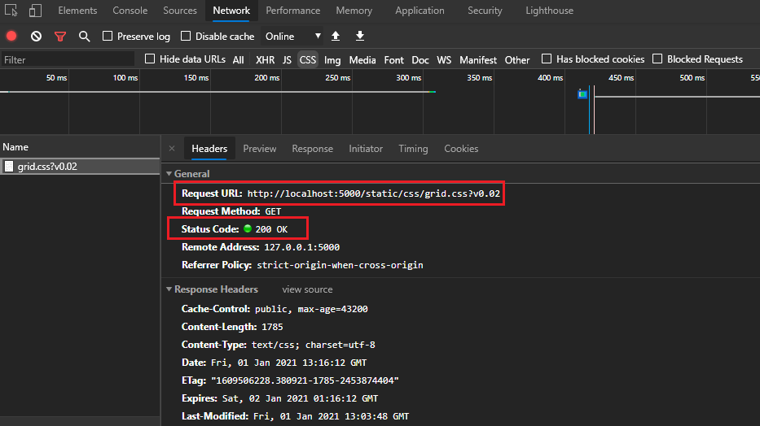
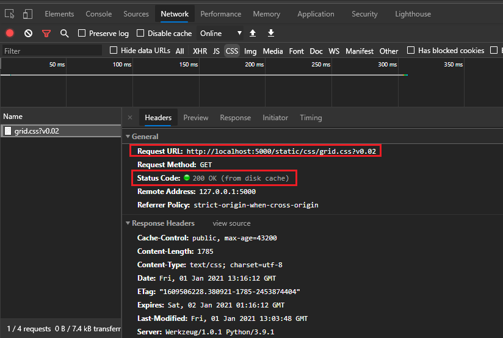

# CSS Caching

Once loaded the ```css``` files they are most probably cached by the browser and  not loaded anymore even if they are changed meanwhile. 
One way to avoid this and load the files once changed the following trick should  do the job.

In the picture below to the `URL` of the `css` is added also a parameter which can be seen as a version. 


If the content of the ```css``` file is changed then the user should change also the *version* so the files is reloaded also on the load of hte `html` page.

Example: 

```html
<meta charset="utf-8">
<meta name="author" content="James J James">
<title>template 1</title>
<link href="/static/css/grid.css?v0.02" rel="stylesheet">
<link href="/static/css/stores-form.css?v0.01" rel="stylesheet">
<link href="/static/css/items-form.css?v0.01" rel="stylesheet">
```

The behavior in the Chrome Developer tools:

When loading for the first time:



The **Status Code:** is OK.

When loaded for the second time and the subsequent times, then the code is still ok but is also mentioned that the file was loaded **from disk cache**. 



