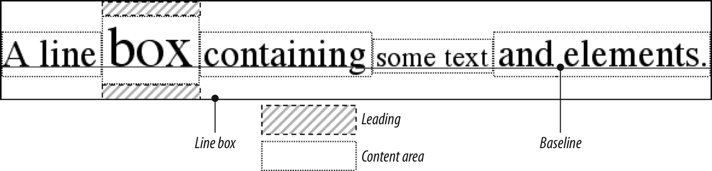

# CSS - Text Properties

The **block direction** is the direction in which block elements are placed by default in the current writing mode.  In English, for example, the **block direction** is **top to bottom**, or vertical, as one paragraph (or other text element) is placed beneath the one before.

The **inline direction** is the direction in which inline elements are written within a block.  To again take English as an example, the **inline direction** is **left to right**, or horizontal.  In languages like Arabic and Hebrew, the inline direction is right to left instead.

### text-indent

e.g.

```css
div#outer {width: 500px;}
div#inner {text-indent: 10%;}
p {width: 200px;}
```

```html
<div id="outer">
    <div id="inner">
        This first line of the DIV is indented by 50 pixels.
        <p>
            This paragraph is 200px wide, and the first line of the 
            paragraph is indented 50px. This is because computed values 
            for 'text-indent'are inherited, instead of the  declared 
            values.
        </p>
    </div>
</div>
```

### text-align

The property `text-align`, which affects how the lines of text in an element are aligned with respect to one another: e.g. `left`, `right`, `center`, `justified`, ....

### line-height

The distance between lines can be affected by changing the **height** of a line. Note that **height** here is with respect to the line of text itself. `line-height` controls the **leading**, which is the extra space between lines of text above and beyond the font’s size. 




