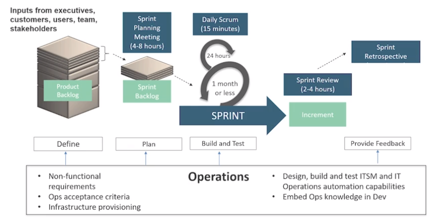

# DevOps and other Methodologyes and Frameworks

- Agile
- Lean
- ITSM - IT Service Management 
- Safety Culture 

## Agile 

Agile enterprise - refers to a organization

Agile software development - small and often releases 
Agile software development methods:
  - scrum
  - scrumban (combination between Scrum and Kanban)  
  - scaled Agile Framework - SAFe

| Agile  | Clasical |
|-|-|
Individuals and interractions | Processes and Tools |
Working softrware | Comprehensive Documentation |
Collaboration with customer | Negociating contracts |
Responding to change | Following a plan |

