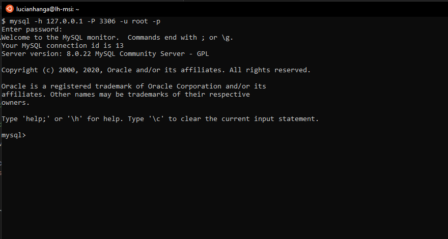

# Docker Databases

## Docker MongoDB

Download the **mongodb** docker image and start it using an external volume.

```bash
# pull the lastest mongo image from the repository
docker pull mongo
# create the volume which will serve as db volume for mongodb docker
mkdir -p /docker.volumes/mongodb.volume
chmod -R a+rwx /docker.volumes/mongodb.volume

# start the mongo db docker with the volume on the host
# -p exposed-port:internal-port
# -v external-volume-path:internal-mapping-path
# --name : the name of the containter
# -d  : daemon mode (as oposed to -it )
docker run -p 27017:27017 \
           -v /docker.volumes/mongodb.volume:/data/db  \
           --name mongo -d mongo
```

## Docker mySQL 

```bash
# pull the latest mysql image from repository
docker pull mysql
# create the volume which will be used as db volume for mysql docker
mkdir -p /docker.volumes/mysql.volume
chmod -R a+rwx /docker.volumes/mysql.volume
docker run -p 3306:3306 \
           -v /docker.volumes/mysql.volume:/var/lib/mysql \
           -e "MYSQL_ROOT_PASSWORD=Test1234."  \
           --name mysql -d mysql
```

Connect to the mysql docker containter:

```bash
 mysql -h 127.0.0.1 -P 3306 -u root -p
```

output: 



