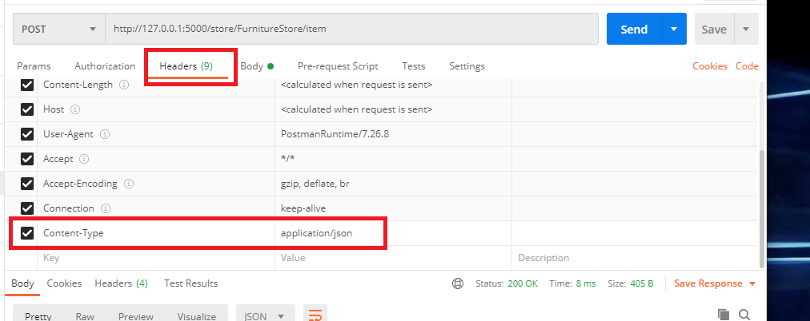
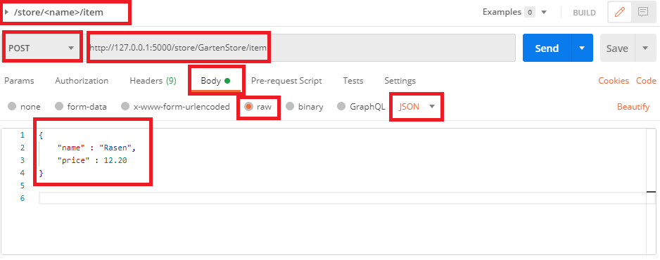

# Flask and REST API

<br>

## Basic Flask Application

```python
from flask import Flask;

app = Flask(__name__);

@app.route('/') # http://localhost:9001/
def index():
    return 'Hello World!', 200

app.run(port=5000, debug=True)
```

The `True` from `app.run(port=5000, True)` means that the application will run in debug mode. Between others it means when the code changes the application is restarted.

<br>

## HTTP Verbs

When in a browser the user writes:

`http://www.google.com/index.html`

the the server beween others receives:
```http
GET /index.html HTTP/1.1
Host: www.google.com
```

+ `GET` - is the verb
+ `/index.html`   - is the path
+ `HTTP/1.1` - protocol

The most important **HTTP Verbs** are:

+ `GET` - retrieve something  - e.g. `GET /item/1` - get the item with the ID 1
+ `POST` - for server means receive data and use it. 
  e.g. `POST /item` 
  which should be also accompanied by some additional data, something like a json:
   ```javascript
        {
           'name': 'james', 
            'address; : ;Johanstr. 12, Munich, 80939' 
        } 
    ```
    and it could create an item with the information in the JSON object.
+ `PUT` - for server means receive the data and if create an entity if it does not exist or update an already existing one. - e.g. `PUT /item` which like in case of `POST` should be acompanied by some data which is used to create/update an item.
+ `DELETE` - remove something - e.g. `DELETE /item/1` - for instance it can mean: remove the item with the index/id 1.

<br>

## REST Principles

Its does not responses only with data but rather with `resources`.
e.g.
```http
GET /item/chair
POST /item/chair   with_some_extra_datra
PUT /item/chair    with _some_extra_data
DELETE /item/chair
```
it accesses the `chair` element of the  `item` resource. Its like working in OOP with an object.

`GET /items`

It retrieves all the elements of the resource `item`` and in OOP it would be like retrieveing the list of all the ojects of, an object list. 

REST is **stateless** one request does not depend on the previous requests. If the data from previous requests is required in the future requests it should be send with all the future requests. E.g. user logs in a system with a first `GET` request and it receives an identification *token*. This *token* should be sent together will all the subsequent requests otherwise the server does not know that the request comes from that specific user.

## JSON - support for data transmission

`JSON` is used by REST to send and receive data between the clients and server(s). Flask is using `flask.jsonify` to transform a dictionary into a JSON string.

In case the data structure which has to be sent is not a dictionary but a list of dictionaries then it should be make a dictionary first and then called `flask.jsonify`:

```python
stores = [
    {
        'name:':'Furniture Store',
        'items' : [
            {
                'name' : 'Chair',
                'price' : 15.99
            },
            {
                'name' : 'Armchair',
                'price' : 66.66
            },
        ],
    },
]

# GET /store
#   return a list with all the stores
@app.route('/store', methods=['GET'])
def get_stores():
    return jsonify({'stores': stores}), 200
```

JSON **ALWAYS** uses **DOUBLE QUOTES** and NOT single quotes.

## Postman POST with REST data

Using postman to send a POST request to the server:

+ setup the appropriate headers to have the server recognising the conent as `JSON`
  


+ specify the REST API data: the JSON object




