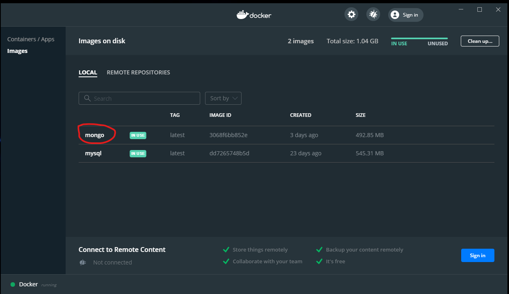

# MongoDB in Docker 

## Install and run the mongoDB

Pull and create the container using a local folder for the database.

```bash
    $ sudo bash
    $ docker pull mongo
    $ docker run -p 27017:27017 -v /docker.volumes/mongodb.volume:/data/db --name mongo -d mongo
```

Check out the docker status:



In the folder which was mapped to the ```/data/db```:

```bash
$ ls -l /docker.volumes/mongodb.volume/
total 72
-rw------- 1 999 999   47 Dec 13 21:35 WiredTiger
-rw------- 1 999 999   21 Dec 13 21:35 WiredTiger.lock
-rw------- 1 999 999  963 Dec 13 21:35 WiredTiger.turtle
-rw------- 1 999 999 4096 Dec 13 21:35 WiredTiger.wt
-rw------- 1 999 999 4096 Dec 13 21:35 WiredTigerHS.wt
-rw------- 1 999 999 4096 Dec 13 21:35 _mdb_catalog.wt
-rw------- 1 999 999 4096 Dec 13 21:35 collection-0--1168945702192226191.wt
-rw------- 1 999 999 4096 Dec 13 21:35 collection-2--1168945702192226191.wt
-rw------- 1 999 999 4096 Dec 13 21:35 collection-4--1168945702192226191.wt
drwx------ 2 999 999 4096 Dec 13 21:35 diagnostic.data
-rw------- 1 999 999 4096 Dec 13 21:35 index-1--1168945702192226191.wt
-rw------- 1 999 999 4096 Dec 13 21:35 index-3--1168945702192226191.wt
-rw------- 1 999 999 4096 Dec 13 21:35 index-5--1168945702192226191.wt
-rw------- 1 999 999 4096 Dec 13 21:35 index-6--1168945702192226191.wt
drwx------ 2 999 999 4096 Dec 13 21:35 journal
-rw------- 1 999 999    2 Dec 13 21:35 mongod.lock
-rw------- 1 999 999 4096 Dec 13 21:35 sizeStorer.wt
-rw------- 1 999 999  114 Dec 13 21:35 storage.bson
```
## Connect to mongodb from the docker 

To test if all ok, first connect to the mongoDB from the containter.

```
$ docker exec -it mongo bash
root@9a631ac0b065:/# mongo
MongoDB shell version v4.4.2
connecting to: mongodb://127.0.0.1:27017/?compressors=disabled&gssapiServiceName=mongodb
Implicit session: session { "id" : UUID("5538b970-a896-4253-a226-e9807f54ac3a") }
MongoDB server version: 4.4.2
> show dbs
admin   0.000GB
config  0.000GB
local   0.000GB
> exit
bye
root@9a631ac0b065:/#

```

## Connect to mongodb from the host

Once the mongoDB is running in the containter the user can connect to it from the local host like it is connecting from the docker containter, by just running ```mongo``` command.


