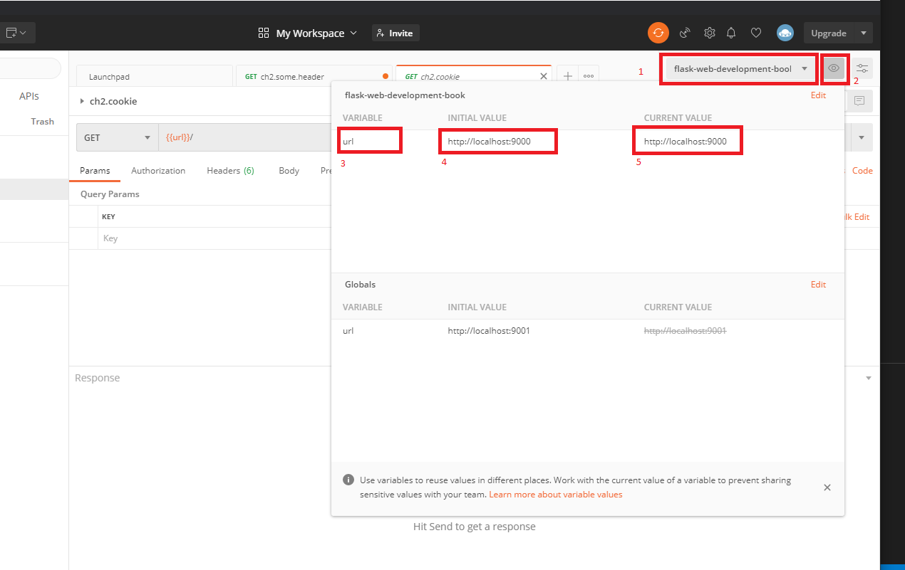

# Postman 

Pefect for testing Flask applications.

## Seting up the envorinement for Postman ##

To avoid copy&paste and easy changes on multiple tests the use of environmnet variables is recommended.

1. is the name of the environment
2. press the _eye_ button to get the environment content window
3. the name of the environment variable
4. the initial avalue of the variable
5. the current value of hte variable

