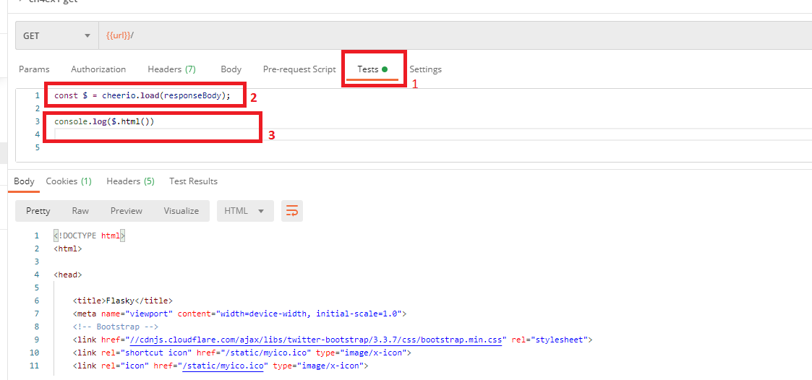
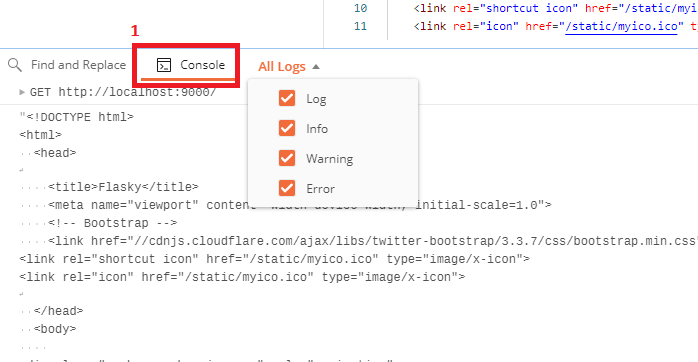
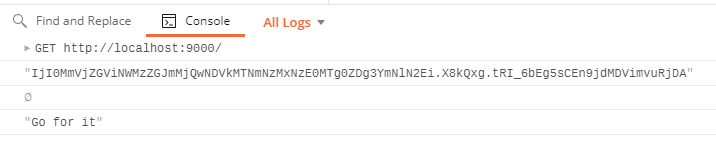

# Postman 2

How to analize and extract information from the requests responses using the [cherrio](https://cheerio.js.org), a fast, flexible & lean implementation of core jQuery designed specifically for the server.

More information about writing scripts in Postman you can find at [Scripting with Postman](https://learning.postman.com/docs/writing-scripts/intro-to-scripts/).

Tthe request definition allows also to execute a suite of tests after the execution and the response was received.

In the picture below you can see how to access the test feature of the Postman and presents a very very basic usage of the test feature:



1. **Tests** Tab where the user can add its testing code. Even if its called **Tests** it does not necessarily have to be a test but also code which can parse and extract information from the response.

2. the command which loads the answer body into the cheerio parser and prepares it for parsing.

3. logging of the whole html document. This command will write information into the console. In the next picture will be presented also the console.




1. The console tab where the information written with ```console.log()``` or ```console.warning()``` or ... will be written.


## Example how to obtain the values of a form members

Sniplet from the response body:

```html
<form action="" method="post" class="form" role="form">
  <input id="csrf_token" name="csrf_token" type="hidden" value="IjI0MmVjZGViNWMzZGJmMjQwNDVkMTNmNzMxNzE0MTg0ZDg3YmNlN2Ei.X8kQxg.tRI_6bEg5sCEn9jdMDVimvuRjDA">
  <div class="form-group  required">
    <label class="control-label" for="name">What is your name?</label>
    <input class="form-control" id="name" name="name" required type="text" value="">
  </div>
  <input class="btn btn-default" id="submit" name="submit" type="submit" value="Go for it">
</form>
```

The code to extract the information you require:

```javascript
const $ = cheerio.load(responseBody);
console.log($('input[id="csrf_token"]').attr('value'));
console.log($('input[id="name"]').attr('value'));
console.log($('input[id="submit"]').attr('value'));
```

The result in the postman log:



