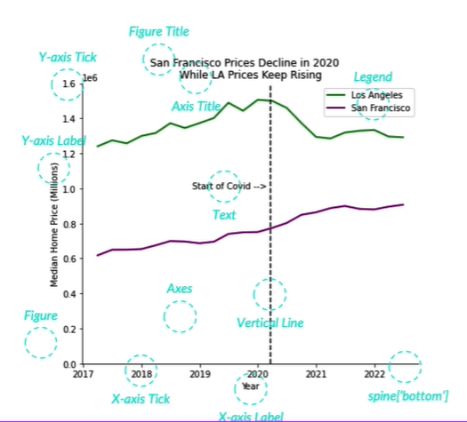
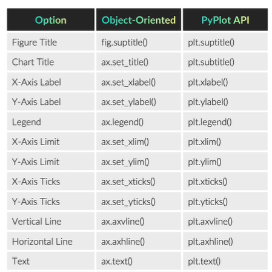

# The Chart

## Anatomy of a Chart

At first you create a `fig` and `ax` objects first.

`fig` - the figure object - the whole chart - the canvas. The **figure** object is the top level container for all the elements in a figure. 

`ax` - the axes object - the chart area - the plot area. The **axes** object is the part of the figure that contains the actual chart. You can have multiple axes in a figure.

```python
import matplotlib.pyplot as plt

# creating a figure and axes
fig, ax = plt.subplots()

# creating a figure and two axes
fig, (ax1, ax2) = plt.subplots(1, 2)

# adding an axes to an existing figure
ax = fig.add_subplot(3) // 
```

## Figure Object

It contains the following elements:

- `fig.title` - the figure title - the title of the chart


```python
fig.set_title( "My Chart Big Title" )
```

# Axes Object

- `ax.title` - the axes title - the title of the chart area
- `ax.ylabel` - the y axis label
- `ax.xlabel` - the x axis label
- `ax.legend` - the legend

```python
ax.set_title( "My Chart")
ax.set_ylabel("Y Axis")
ax.set_xlabel("X Axis")
ax.legend()
```





## Font 

You can specify the font size, color, style, etc. of the chart elements.

```python
# set the font size of the title
ax.title.set_fontsize(20) # 20 points
# or you can use a predefined size: xlarge, large, medium, small, xsmall
ax.title.set_size(xlarge) # xlarge is a predefined size in matplotlib 
# set the color of the title
ax.title.set_color("red")
# set the font style of the title
ax.title.set_fontstyle("italic")
```

another usage example would be:

```python
ax.title( "My Chart", fontsize=20, color="red", fontstyle="italic" )
```

