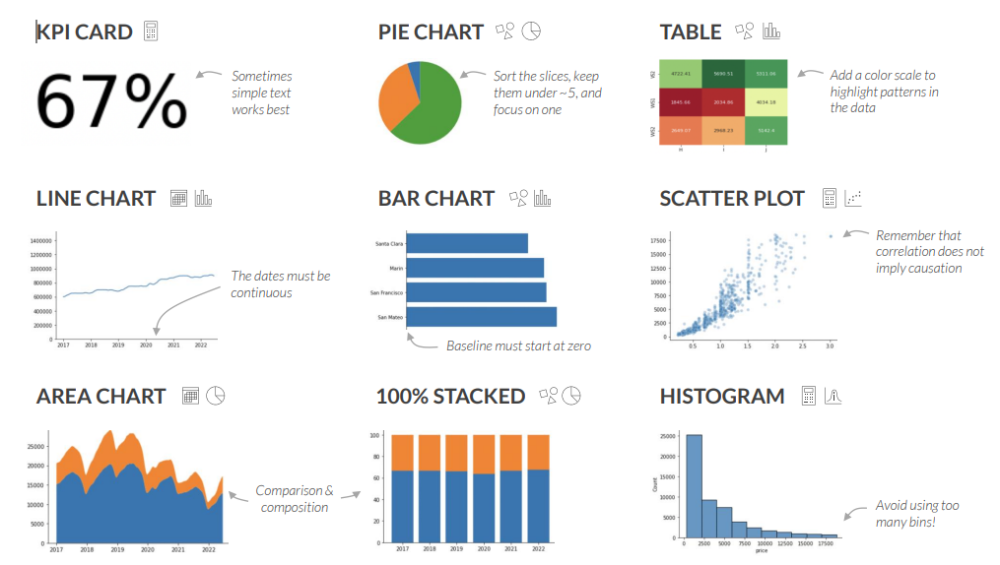
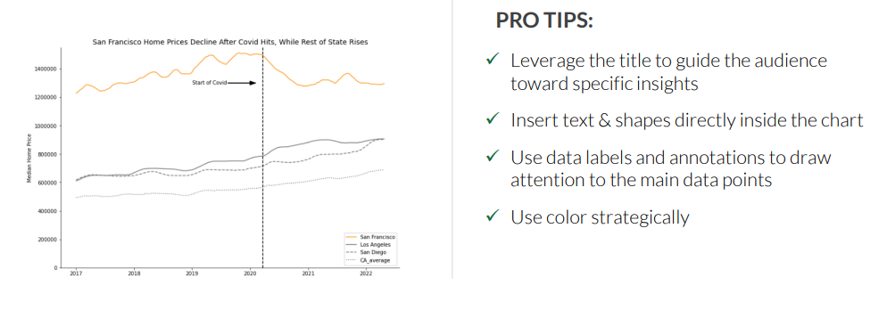
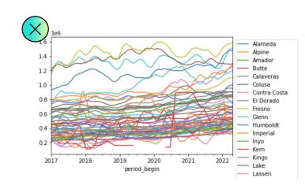

# Data Visualization

## Introduction

**Perception** is processed by the **Visual Cortex** and its **instantaneous**. **Cognition** is processed by the **Prefrontal Cortex** and its **slow and conscious**. **Data visualization** puts both parts of the brain to work. It is a powerful tool for **exploration** and **communication**.

**10 seconds rule** is a good rule of thumb for data visualization. If you can't explain your data in 10 seconds, you need to **improve** your visualization.

**Visualizing** is important before training a model. It helps you to **understand** the data and **identify** the **outliers**.

**Anscombe's quartet** is a set of four datasets that have nearly identical simple descriptive statistics, yet have very different distributions and appear very different when graphed. They were constructed in 1973 by the statistician Francis Anscombe to demonstrate both the importance of graphing data before analyzing it and the effect of outliers on statistical properties.


## Key Questions in Data Visualization

### What *Type of data* you have?

- **Time series** - which is a series of data points indexed in time order.
- **Categorical** - which is a type of data that can be divided into groups
- **Numeric** - which is a type of data that can be measured on a scale. It can be **discrete** or **continuous**.
- **Hierarchical** - which is a type of data that can be divided into groups and subgroups.

### What do you want to *Communicate*?

- **Comparison** - how does one thing compare to another? How are they different or similar? (e.g. `bar chart`)
- **Composition** - what parts make up the whole? What is the relationship between the parts? (e.g. `pie chart`)
- **Distribution** - how is the data distributed? (e.g. `histogram`)
- **Relationship** - how are two variables related to each other? (e.g. `scatter plot`)

### Who is the *audience*?

- **Data scientists** - who is familiar with the data. They are interested in the **details**.
- **Manager** - who is interested in the **general trends**. 
- **Executive** - who is interested in the **big picture**. 
- **General audience** - who is not familiar with the data. Beautiful visualizations are important. Nice colors, fonts, and layout are important.


## Essential Visuals

- **KPI Card/Dashboard** - which is a set of charts that are used to monitor and track the performance of a business, department, or specific process. It is a **snapshot** of the **current** state of the business. Sometimes is just a number or a percentage.

- **Pie Chart** - which is a circular chart divided into sectors, illustrating numerical proportion. It is used to show the **proportional** parts of a whole. Keep it under 6 slices.
  
- **Table/HitMap** - which is a table with color-coded cells. It is used to show the **proportional** parts of a whole. It is a **heatmap**. A color legend is important.

- **Line Chart** - Represents trends over a period of time, and compare data between two or more categories. It is used to show the **trends** over a period of time. It is a **time series**. The time should be continuous.

- **Bar Chart** - Good for comparing data between two or more categories. It is a **categorical** data. The categories should be **discrete**. Baseline should be zero.
  
- **Scatter Plot** - Data visualization in which the values of two variables are plotted along two axes, the pattern of the resulting points revealing any correlation present. It is used to show the **relationship** between two variables. It is a **numeric** data. **Important: corelation does not imply causation.**

- **Area Chart** - Good for comparing data between two or more categories. Its stacked surface is used to show the **proportional** parts of a whole. 

- **100% Stack Chart** - Good for comparing data between two or more categories. It is a **categorical** data. It is a **stacked** bar chart. The sum of the values should be 100%.

- **Histogram** - Good for comparing data between two or more categories. It is a **distribution** of a **numeric** data. Don't use too many bins (bars).



## Chart Formatting

Is used to **communicate** the **message**. It is important to **highlight** the **important** information and eliminate the **noise**.


> Perfection is achieved not when there is nothing more to add, but when there is nothing left to take away. - Antoine de Saint-Exupéry


## Common Mistakes

- The **wrong visual** for the type of data you have. 
- **Too many series** in a single visual.

- Little to no context for the data. No **title**, **legend**, **axis labels**, **units**, **source**.
- Using inconsistent **colors** over multiple charts. Use same colors for the same series across multiple visuals.


### Reading Data 

Read data from .xls

```python
import pandas as pd
df = pd.read_excel('data.xls')
# add another column as difference between two columns by name
df['diff'] = df['col1'] - df['col2']
# add another column as difference between two columns by index
df['diff'] = df.iloc[:, 0] - df.iloc[:, 1]
# add another column as index 
df['index'] = df.index
```

get information about the read data

```python
df.info()
```


