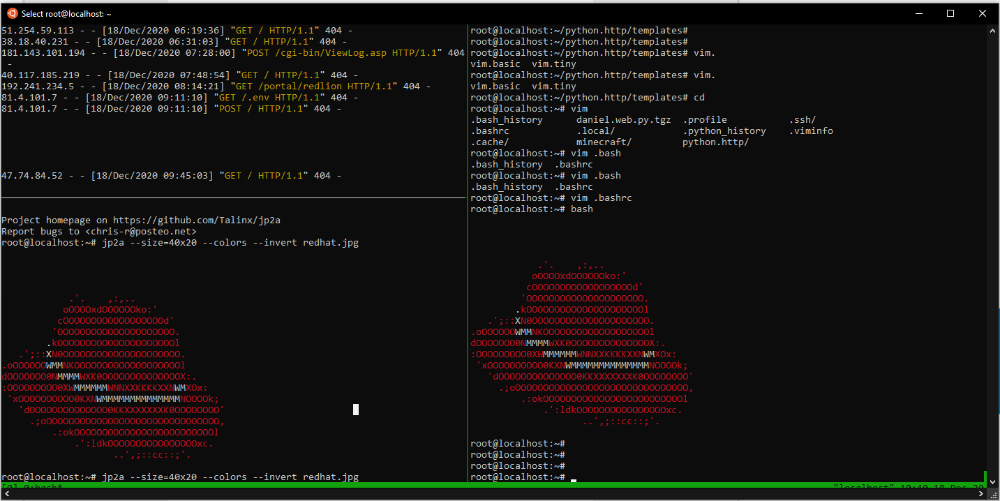
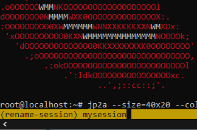

# T-Mux

The powerfull multiplexer terminal:



## Session Commands

### Detach from a session

`Ctrl+b d`

### List all sessions

```bash

$ tmux ls
0: 1 windows (created Sat Dec 12 15:03:37 2020) (attached)
```


### Attach to a running session

```tmux a -t session-name```
```bash
$ tmux a -t 0
```

### Give a name | Rename a session

``` Ctrl+b $```



### Kill a session

```bash
$ tmux ls
mysession: 1 windows (created Sat Dec 12 15:03:37 2020)
$ tmux kill-session -t mysession
$ tmux ls
no server running on /tmp/tmux-0/default
```

## Panes

### split pane horizontal  
```Ctrl+b "```
### split pane vertical 
```Ctrl+b %```
### close current pane 
```Ctrl+b x```

### switch panes
```Cltrl+b ← ```
```Cltrl+b ↑ ```
```Cltrl+b → ```
```Cltrl+b ↓ ```

### resize a pane

```Ctrl+b : resize-pane -D 10```
```Ctrl+b : resize-pane -U 10```
```Ctrl+b : resize-pane -L 10```
```Ctrl+b : resize-pane -R 10```

### copy & paste

- Enter **copy mode** by pressing `CTRL+b, [`.
- Use the arrow keys to go to the position from where you want to start copying. 
- Press `CTRL+SPACE` to start copying.
- Use arrow keys to go to the end of text you want to copy. 
- Press `ALT+w` or `CTRL+w` to copy into Tmux buffer.
- Press `CTRL+b, ]` to paste in a possibly different Tmux pane/window.


